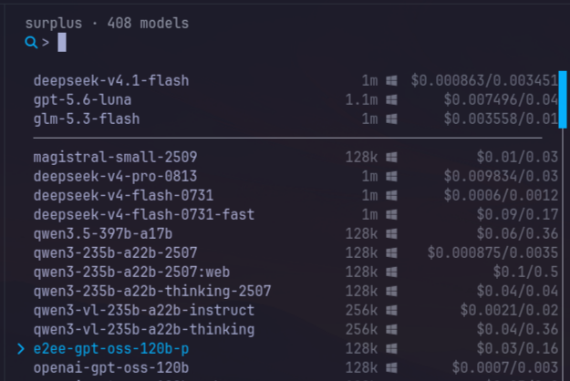

# pi-surplus

[Surplus Intelligence](https://www.surplusintelligence.ai/) gateway provider for [Pi](https://pi.dev) and [Oh My Pi (OMP)](https://github.com/can1357/oh-my-pi).

Registers a `surplus` provider backed by the live Surplus Intelligence API — no bundled model list:



- **Live catalog** — OpenRouter-compatible `/v1/models`: context length, modalities, supported parameters
- **Live marketplace pricing** — `/api/markets` cheapest seller offer per model, falling back to catalog reference price (USD)
- **Always current** — models are fetched dynamically, never frozen at a snapshot; on OMP the host caches for 24 h (`omp models refresh` forces a re-fetch), on Pi the provider refreshes through the host's model-refresh flow

## Install

Requires [Bun](https://bun.sh/) in `PATH`.

```bash
omp install pi-surplus           # Oh My Pi
pi install npm:pi-surplus        # Pi
```

Set your API key:

```bash
export SURPLUS_INTELLIGENCE_API_KEY=...
```

Models appear as `surplus/<model-id>` in `/model`.

## License

[MIT](./LICENSE)
